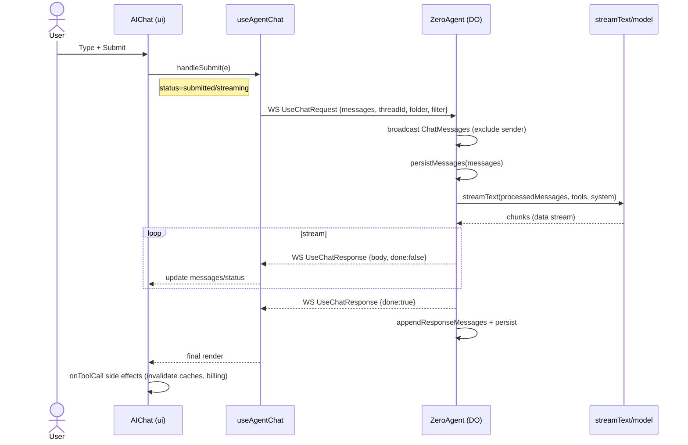

# Zero Mail – Chat Message Flow

This document explains the end-to-end order of operations when a user sends a message in the chat, with references to the relevant code.

## Overview
- The UI submits a message via `useAgentChat`.
- The message is sent over the Agent WebSocket to the `ZeroAgent` Durable Object.
- The server broadcasts and persists the user message, orchestrates tools, selects a model + system prompt, and streams AI output back.
- The client renders streaming text and tool outputs, and performs cache/billing side effects.

## Frontend: Message submit and UI state
- File: `apps/mail/components/create/ai-chat.tsx` (`AIChat`)
  - Submit handler calls `handleSubmit(e)` provided by `useAgentChat` and clears the editor:
    - `onSubmit` at `ai-chat.tsx:239-246`
  - Shows “zero is thinking...” while `status` is `submitted` or `streaming`:
    - `ai-chat.tsx:356-362`
  - Renders empty-state or messages (text blocks + tool invocations):
    - Map: `ai-chat.tsx:291-351`
    - Tool switch: `ToolResponse` for `GetThread`, `GetUserLabels`, `ComposeEmail`:
      - `ai-chat.tsx:184-196`
  - Billing gate: if `chatMessages.enabled` is false, shows upgrade prompt:
    - `ai-chat.tsx:264-273`

## Frontend: Agent connection and chat hook
- File: `apps/mail/components/ui/ai-sidebar.tsx`
  - Establish the Agent connection to the backend DO:
    - `useAgent({ agent: 'ZeroAgent', name: activeConnection?.id || 'general', host: import.meta.env.VITE_PUBLIC_BACKEND_URL, onMessage, onError })`
    - `ai-sidebar.tsx:387-393`
  - Initialize chat state and handlers:
    - `useAgentChat({ agent, maxSteps: 10, body: { threadId, currentFolder, currentFilter }, onError, onResponse, onToolCall })`
    - `ai-sidebar.tsx:395-466`
  - The `body` is contextual metadata sent with each chat message (thread/folder/filter).

## Server: Receiving the chat request
- File: `apps/server/src/routes/agent/index.ts` (`ZeroAgent` extends `AIChatAgent`)
  - Incoming WebSocket messages handled by `onMessage`:
    - `index.ts:1840+`
  - For `IncomingMessageType.UseChatRequest` (POST):
    1) Parse `{ messages, threadId, currentFolder, currentFilter }` from `data.init.body`:
       - `index.ts:1857-1864`
    2) Broadcast the user messages to other clients and persist:
       - Broadcast: `broadcastChatMessage({ type: ChatMessages, messages }, [connection.id])` at `index.ts:1865-1871`
       - Persist: `persistMessages(messages, [connection.id])` at `index.ts:1872`
    3) Process the chat via `onChatMessageWithContext` (streams response):
       - `index.ts:1877-1891`

## Server: Tools, prompt, and model selection
- File: `apps/server/src/routes/agent/index.ts`
  - `getDataStreamResponse(...)` prepares the tool stack and model, then runs `streamText`:
    - Connect MCP tools and auth tools: `mcp.unstable_getAITools()` + `authTools(connectionId)`
      - `index.ts:1756-1763`
    - Pre-process messages w/ tool calls: `processToolCalls({ messages, dataStream, tools }, {})`
      - `index.ts:1764-1771`
    - Model selection:
      - If `env.USE_OPENAI === 'true'`: `groq('openai/gpt-oss-120b')`
      - Else: `anthropic(env.OPENAI_MODEL || 'claude-3-7-sonnet-20250219')`
      - `index.ts:1773-1777`
    - System prompt with context: `getPrompt(getPromptName(...), AiChatPrompt(), { currentThreadId, currentFolder, currentFilter })`
      - `index.ts:1787-1791`
    - Start streaming: `streamText({ model, maxSteps: 10, messages: processedMessages, tools, onFinish, onError, system })`
      - `index.ts:1778-1795`

## Server: Streaming the response
- File: `apps/server/src/routes/agent/index.ts`
  - `reply(id, response)` iterates the response body and broadcasts chunks:
    - For each chunk: `OutgoingMessageType.UseChatResponse` with `{ id, body, done: false }`
      - `index.ts:1969-1975`
    - Final message: `{ done: true }`
      - `index.ts:1977-1982`
  - On finish, append assistant messages to the transcript and persist; clear abort controller:
    - `appendResponseMessages` + `persistMessages` in `onChatMessageWithContext` callback
      - `index.ts:1880-1887`

## Client: Rendering the stream and side effects
- Rendering messages and tool results handled by `AIChat`:
  - Text/tool blocks under `messages.map(...)`
  - `ai-chat.tsx:291-351`
- Side effects on tool calls inside `onToolCall`:
  - Updates analytics, invalidates caches for labels/sent folder/threads, tracks usage, refreshes billing
  - `ai-sidebar.tsx:429-466`
- Request lifecycle effects:
  - `onResponse`: checks `response.ok`, captures analytics
  - `onError`: captures analytics and shows toast
  - `ai-sidebar.tsx:406-428`

## Server: Initial connect and other events
- On connection, server pushes an initial `Mail_List` (inbox) to client:
  - `onConnect` sends `{ type: OutgoingMessageType.Mail_List, folder: 'inbox' }`
  - `index.ts:1731-1737`
- Client `onMessage` parses and invalidates queries accordingly (mail list/get, labels, DO state):
  - `ai-sidebar.tsx:353-385`

## Abort and cancel logic
- Per-message abort controllers are tracked in the server:
  - `getAbortSignal`, `removeAbortController`, `cancelChatRequest`, `destroyAbortControllers`
  - `index.ts:1809-1827`, `index.ts:1833-1838`, `index.ts:1986-1991`

## TL;DR sequence
1) `AIChat.onSubmit` -> `useAgentChat.handleSubmit`.
2) `useAgentChat` sends WS `UseChatRequest` with `messages` + context `{ threadId, currentFolder, currentFilter }`.
3) Server `ZeroAgent.onMessage`:
   - Broadcast + persist user messages.
   - Orchestrate tools, build system prompt, choose model, run `streamText`.
   - Stream chunks as `UseChatResponse` and finally `done: true`.
   - Persist final assistant messages.
4) Client `useAgentChat` updates `messages`/`status` as chunks arrive.
5) `AIChat` renders text and tool responses; `onToolCall` triggers cache/billing updates.

## Sequence Diagram

## Error Handling and Retries
- __Abort from client__: The server tracks per-message abort controllers (`getAbortSignal`, `removeAbortController`, `cancelChatRequest`, `destroyAbortControllers` in `apps/server/src/routes/agent/index.ts`). When canceled, the stream is stopped and controllers are cleaned up.
- __Disconnect/reconnect during stream__: On reconnect, the server sends initial state (`Mail_List`). Any in-flight stream is terminated server-side via abort controllers; the user can resend.
- __Tool failures__: If a tool errors, the server surfaces the failure in the streamed body and `onError`/toasts capture the event on the client. Side effects in `onToolCall` should be guarded against partial results.
- __Validation/malformed requests__: Requests missing required fields should be short-circuited server-side with an error frame; verify behavior in `onMessage` parsing.

## Message Contracts (reference)
- __Incoming WS__ `UseChatRequest` (from client to DO):
  - Body carries `messages` and context `{ threadId, currentFolder, currentFilter }`.
  - Server broadcasts `ChatMessages` (excluding sender), persists user messages, then streams a response.
- __Outgoing WS__ `UseChatResponse` (from DO to clients):
  - Streaming chunks `body` with `done: false`, followed by a final frame `{ done: true }`.
- __Other WS frames__:
  - `Mail_List` (initial inbox state on connect)
  - `ChatMessages` (broadcast of user messages)

## Config and Model Selection
- __Tools__: Combined MCP tools + auth tools assembled in `getDataStreamResponse` before streaming.
- __Model switch__ (server):
  - If `env.USE_OPENAI === 'true'` → `groq('openai/gpt-oss-120b')`.
  - Else → `anthropic(env.OPENAI_MODEL || 'claude-3-7-sonnet-20250219')`.
- __System prompt__: Built via `getPrompt(getPromptName(...), AiChatPrompt(), { currentThreadId, currentFolder, currentFilter })`.
- __Max steps__: `streamText({ maxSteps: 10, ... })`.

## Testing Checklist
- __Happy path__: Submit a message; observe broadcast, persistence, and streamed assistant chunks; final `done: true`.
- __Abort__: Start a long response and cancel; verify stream stops and controllers are cleared server-side.
- __Tool calls__: Trigger `GetThread`, `GetUserLabels`, `ComposeEmail`; confirm UI render + side effects (analytics, cache invalidations, billing refresh).
- __Reconnect__: Disconnect WS mid-stream; reconnect; ensure initial `Mail_List` arrives and UI remains consistent.
- __Billing gate__: With `chatMessages.enabled` false, ensure upgrade prompt is shown and submit is blocked.

## Troubleshooting
- __No stream received__:
  - Check agent connection init in `apps/mail/components/ui/ai-sidebar.tsx` (`useAgent` host/name).
  - Confirm `onMessage` in DO receives `UseChatRequest` (server logs at entry).
- __Model/tools not applied__:
  - Inspect `getDataStreamResponse` logs for selected tools/model and prompt assembly.
- __Stuck “thinking...”__:
  - Ensure `UseChatResponse { done:true }` is emitted; verify `reply(...)` loop and `onFinish` callbacks.
- __Caches not updating after tool calls__:
  - Confirm `onToolCall` runs and invalidates the expected queries in `ai-sidebar.tsx`.

## Trace Logging Points (added)
- __Client__ `AIChat.onSubmit`: log submit and input length
- __Client__ `useAgent` init: log agent name/host
- __Client__ `useAgentChat.onResponse`/`onError`: log status/ok
- __Client__ `onToolCall`: log tool name and args summary
- __Server__ `onMessage` entry: log `type`, `connection.id`
- __Server__ UseChatRequest: log `messages.length`, `{threadId, currentFolder, currentFilter}`
- __Server__ before broadcast/persist
- __Server__ before `onChatMessageWithContext`
- __Server__ `reply`: log start/end of streaming
